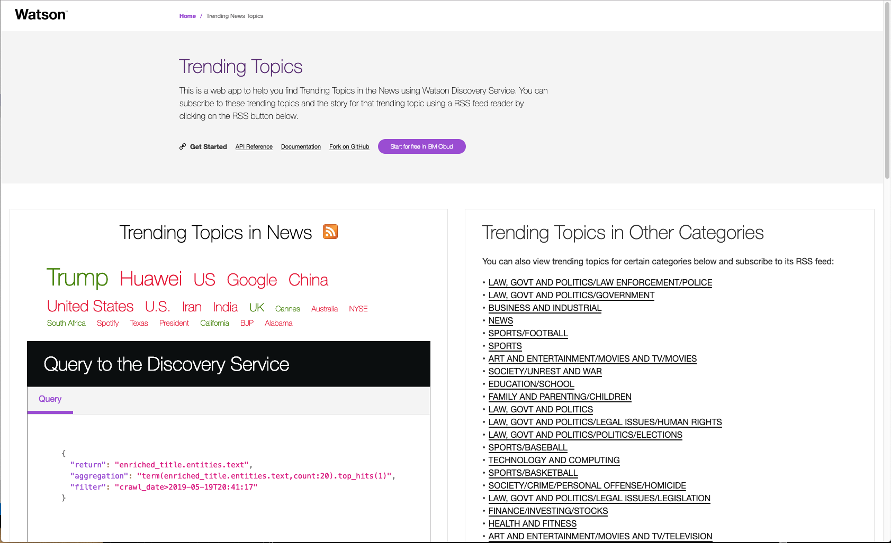
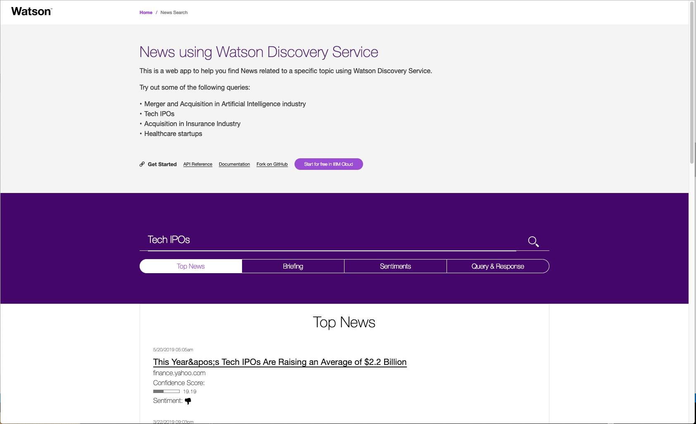

[](https://travis-ci.org/IBM/watson-discovery-news)

# Query Watson Discovery News using the Watson Discovery Service

## Summary

The web is home to massive amounts of data, with more being created every day. Organizations can harness this constant stream of information to gain understanding, plan strategies, and find opportunities. Enriched news data can help your application make dynamic connections across current events faster. In this exercise, you'll start with the basics and build your own news mining web application using JavaScript, Node.js, and the Watson Discovery service. In this exercise:

* Code is written in Node.js, with the server-side using the Express framework and the client using ReactJS.
* You'll use the pre-built Watson Discovery News collection
* You'll access the Watson Discovery service through the Watson Discovery API

Optionally, you can choose to:

* Host the app on the IBM Cloud

## Description

This code pattern shows you how to tap into massive data sets to mine insight. You'll build a news mining web application with the Watson Discovery service using the Watson Node.js SDK. The app demonstrates two use cases using Watson Discovery News:

* **Search**: Query for the most relevant new articles about a specific topic or subject. Because the news collection is pre-enriched with natural language processing, you can query not just on keywords or categories but also on concepts, sentiment, and relations to get richer search responses.

## Flow


1. The user interacts with the Watson Discovery News Server via the app UI.
1. User input is processed and routed to the Watson Discovery News Server.
1. The Watson Discovery News Server sends user requests to the Watson Discovery Service.
1. The Watson Discovery Service queries the Watson News Collection.

# Included components

* [Watson Discovery](https://www.ibm.com/watson/services/discovery/): A cognitive search and content analytics engine for applications to identify patterns, trends, and actionable insights.

# Featured technologies

* [Node.js](https://nodejs.org/en/): An asynchronous event driven JavaScript runtime, designed to build scalable applications
* [React](https://reactjs.org/): Javascript library for building User Interfaces
* [Express](https://expressjs.com): A popular and minimalistic web framework for creating API and Web server

# Watch the Video

[](https://youtu.be/EZGgvci9nC0)

## Deployment options

Click on one of the options below for instructions on deploying the app.

|   |   |   |
| - | - | - |
| [](doc/source/openshift.md) | [](doc/source/cf.md) | [](doc/source/local.md) |

## Troubleshooting

* Error deploying to IBM Cloud using the [Deploy to Cloud Foundry](doc/source/cf.md) option

If you see the following in the logs for a Deploy to IBM Cloud using Cloud Foundry in the `Stage History`, click the `Redeploy` button. This should get past the race condition during the deployment.

```bash
Binding service discovery-news-service to app sda-watson-discovery-news-9-4 in org scott.dangelo / space dev as scott.dangelo@ibm.com...
FAILED
Could not bind to service discovery-news-service
Error: Server error, status code: 409, error code: 60016, message: An operation for service instance discovery-news-service is in progress.

Finished: FAILED
```

## Sample output

The trending page:



<br>

The query page:



<br>

## Deep Dive Videos

Here is a series of short videos that go into more of the details about the features of this code pattern.

* Part 1 - Navigating the UI
* Part 2 - Code walkthrough
* Part 3 - Watson Discovery service APIs

[](https://www.youtube.com/playlist?list=PLOCckZJT4e3OzgykV0mEpZE6zKHysgIr6)

# Links

* [Demo on Youtube](https://youtu.be/EZGgvci9nC0): Watch the video.
* [Watson Node.js SDK](https://github.com/watson-developer-cloud/node-sdk): Download the Watson Node SDK.
* [Cognitive discovery architecture](https://www.ibm.com/cloud/garage/architectures/cognitiveDiscoveryDomain): Learn how this code pattern fits into the Cognitive discovery Reference Architecture.
* [Overview of the Watson Discovery service](https://www.ibm.com/watson/services/discovery/): Extract value from unstructured data by converting, normalizing, enriching it.
* [Three ways IBM has evolved Alchemy Data News into Watson Discovery News and made it even better](https://www.ibm.com/blogs/watson/2017/04/3-ways-ibm-evolved-alchemy-data-news-watson-discovery-news-made-even-better/): Watson Discovery News takes big steps forward in NLP-enriched news search.
* [IBM launches Watson Discovery Service for big data analytics at scale](https://www.techrepublic.com/article/ibm-launches-watson-discovery-service-for-big-data-analytics-at-scale/):
Suite of APIs makes it easier for companies to ingest and analyze their data, even if they don’t have advanced degrees in data science.
* [SlideShare: Building with Watson – Network Visualizations using Watson Discovery](https://www.slideshare.net/IBMWatson/building-with-watson-network-visualizations-using-watson-discovery): See an app built on the Watson Discovery Service and D3.js that helps you explore your data using a network map built on NLP metadata.

# Learn more

* **Artificial Intelligence Code Patterns**: Enjoyed this Code Pattern? Check out our other [AI Code Patterns](https://developer.ibm.com/technologies/artificial-intelligence/).
* **AI and Data Code Pattern Playlist**: Bookmark our [playlist](https://www.youtube.com/playlist?list=PLzUbsvIyrNfknNewObx5N7uGZ5FKH0Fde) with all of our Code Pattern videos
* **With Watson**: Want to take your Watson app to the next level? Looking to utilize Watson Brand assets? [Join the With Watson program](https://www.ibm.com/watson/with-watson/) to leverage exclusive brand, marketing, and tech resources to amplify and accelerate your Watson embedded commercial solution.

# License

This code pattern is licensed under the Apache License, Version 2. Separate third-party code objects invoked within this code pattern are licensed by their respective providers pursuant to their own separate licenses. Contributions are subject to the [Developer Certificate of Origin, Version 1.1](https://developercertificate.org/) and the [Apache License, Version 2](https://www.apache.org/licenses/LICENSE-2.0.txt).

[Apache License FAQ](https://www.apache.org/foundation/license-faq.html#WhatDoesItMEAN)
