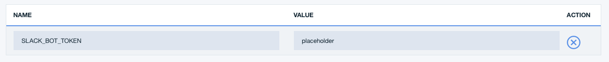

[](https://travis-ci.org/IBM/watson-discovery-news)

# Query Watson Discovery News using the Watson Discovery Service

In this code pattern, we will build a Node.js web application that will use the Watson Discovery Service to access Watson Discovery News.

Watson Discovery News is a default data collection that is associated with the Watson Discovery Service. It is a dataset of primarily English language news sources that is updated continuously, with approximately 300,000 new articles and blogs added daily.

This code pattern will demonstrate two use cases for accessing Watson Discovery News:

* **Trending Topics in the News**: Identify popular topics over the past 24 hours. Topics can be general, or for a specific industry or category.

* **Search**: Query for the most relevant new articles about a specific topic or subject. Results will include enrichment data, such as article summary text and sentiment analysis.

Optionally included will be examples of how to:

* Build a **RSS News Feed** generator to push trending news to your favorite RSS reader.

* Build a **SlackBot** to access the search feature from Slack.


## Flow
1. The user interacts with the Watson Discovery News Server via the app UI.
2. User input is processed and routed to the Watson Discovery News Server.
3. The Watson Discovery News Server sends user requests to the Watson Discovery Service.
4. The Watson Discovery Service queries the Watson News Collection.
5. The Watson Discovery Service sends news articles to the RSS Reader.
6. The Watson Discovery Service responds to Slack search requests.

# Included components

* [Watson Discovery](https://www.ibm.com/watson/services/discovery/): A cognitive search and content analytics engine for applications to identify patterns, trends, and actionable insights.

# Featured technologies

* [Node.js](https://nodejs.org/en/): An asynchronous event driven JavaScript runtime, designed to build scalable applications
* [React](https://facebook.github.io/react/): Javascript library for building User Interfaces
* [Express](https://expressjs.com): A popular and minimalistic web framework for creating API and Web server
* [Yarn](https://yarnpkg.com): Fast, reliable and secure dependency manager for node.js
* [RSS](https://en.wikipedia.org/wiki/RSS): RSS (Rich Site Summary) is a format for delivering regularly changing web content in our case it will be trending topics
* [Slack](https://slack.com): Slack is a cloud-based set of team collaboration tools and services with chat bot integration
* [Botkit](https://www.botkit.ai): Framework for creating and managing chat bots

# Watch the Video

[](https://youtu.be/EZGgvci9nC0)

# Steps

Use the ``Deploy to IBM Cloud`` button **OR** create the services and run locally.

## Deploy to IBM Cloud

[](https://bluemix.net/deploy?repository=https://github.com/IBM/watson-discovery-news.git)

1. Press the ``Deploy to IBM Cloud`` button above and then click on ``Deploy`` option. Remember to create an IBM Cloud API key if required.


2. From the Toolchains view, click on the Delivery Pipeline to watch while the app is deployed. Here you'll be able to see logs about the deployment.


3. To see the app and services that were created use the [IBM Cloud dashboard](https://cloud.ibm.com). The app is named `watson-discovery-news` with a unique suffix. The following services are created:
    * discovery-news-service

Now jump to [Step 4. Configure Slack](#4-configure-slack) to continue.

## Run locally

> NOTE: These steps are only needed when running locally instead of using the ``Deploy to IBM Cloud`` button.

1. [Clone the repo](#1-clone-the-repo)
2. [Create Watson Services with IBM Cloud](#2-create-watson-services-with-ibm-cloud)
3. [Configure Watson Discovery](#3-configure-watson-discovery)
4. [Configure Slack](#4-configure-slack)
5. [Configure the application to use the Slack bot](#5-configure-the-application-to-use-the-slack-bot)

## 1. Clone the repo

Clone the `watson-discovery-news` locally. In a terminal, run:

```bash
git clone https://github.com/ibm/watson-discovery-news
```

## 2. Create Watson Services with IBM Cloud

Create the following service:

  * [**Watson Discovery**](https://cloud.ibm.com/catalog/services/discovery)

## 3. Configure Watson Discovery

Optionally, fill in a name you want to give to your service and click *Create*.


After the service is created the credentials are available on the *Manage* tab. For more advanced credential management, click on the *Service credentials* tab. These credentials will be needed when configuring the app.


## 4. Configure Slack

To integrate a new Slack Bot into your existing Slack team, navigate to `https://<my.slack.com>/apps/manage/custom-integrations`, where `<my.slack.com>` is the Slack workspace you want to customize.

From the **Cutsom Integrations** page, select the **Bots** option.


To add a new bot, select the **Add Configuration** button.


Enter a username for the bot and click **Add bot integration**.


Once created, save the **API Token** that is generated.


## 5. Configure the application to use the Slack bot

### If you used the Deploy to IBM Cloud button...

If you used the ``Deploy to IBM Cloud`` option, most of the setup is automatic, but not quite all of it. We have to update a few environment variables.

From the IBM Cloud dashboard find the app that was created. Click on the ``Runtime`` tab on the menu and navigate to the ``Environment variables`` tab.



Update the following environment variable:

  * Set ``SLACK_BOT_TOKEN`` to the token you saved previously

Save the new value and restart the application, watch the logs for errors.

> **Tip**: :bulb: Try restaging your application if you see an error.

### If you decided to run the app locally...

1. Install [Node.js](https://nodejs.org/en/) and [Yarn](https://yarnpkg.com)

2. Install all of the dependencies by running `yarn`. This will install of the node modules specified in [`package.json`](package.json)

```bash
yarn
```

3. Run `yarn bootstrap` to copy the `.env.sample` to `.env`

```bash
yarn bootstrap
```

4. Edit the `.env` file and enter the Watson Discovery credentials and Slack Bot Token saved in previous steps

5. Start the app by running `yarn start`. If you are developing and making changes to the app and would like the server to restart every time then run `yarn start:watch`

```bash
yarn start
```

6. Open a browser and go to `http://localhost:{PORT}`, where PORT is the value specified in `.env` (default is 3000)

# Running the application

### Search from Slack

The slack bot will respond to certain key words, below is a sample dialog. Remember to `@` the bot each time, or start a private chat. Make sure to invite your bot into other channels using `/invite @<my bot>`.

```
user: @newsbot hi
newsbot: Hello.

user: @newsbot news please
newsbot: Hi there! What news are you interested in?

user: @newsbot toronto raptors
newsbot: You want me to search for news articles about `toronto raptors`?

user: @newsbot yes
newsbot: OK searching...
```


### Trending Topics RSS Feed  

On the **Trending News Panel**, click the RSS Feed button to launch a new tab in your browser. Cut and paste the tab URL into your favorite RSS Reader. If your RSS Feed Reader supports push notifications you can get alerted when trending topics change along with a news article for that topic.

<p align="center">
  
  <br>
  
</p>


> Since RSS feed is a standard way to consume constantly changing data such as news, we can use the RSS feeds we generated to also post news articles to your organizations [slack channel](https://get.slack.help/hc/en-us/articles/218688467-Add-RSS-feeds-to-Slack) to track trends in your industry, or consume the feed to generate a daily digest of news and email in the morning. Other uses may include automatically posting tweets to a Twitter account on news articles on trending topics using a service called [IFTTT](https://ifttt.com/connect/feed/twitter).

# Troubleshooting

* Setting environment variables for a local run

> NOTE: This only needs to be set if the application is running locally.

The credentials for the IBM Cloud services (Discovery), can be found in the ``Services`` menu in IBM Cloud, and selecting the ``Service Credentials``
option.

```bash
# Copy this file to .env and replace the credentials with
# your own before starting the app.

# Watson Discovery
DISCOVERY_URL=<add_discovery_url>
## Un-comment and use either username+password or IAM apikey.
# DISCOVERY_USERNAME=<add_discovery_username>
# DISCOVERY_PASSWORD=<add_discovery_password>
# DISCOVERY_IAM_APIKEY=<add_discovery_iam_apikey>

# Run locally on a non-default port (default is 3000)
# PORT=3000

# Slack
SLACK_BOT_TOKEN=<slack_bot_token>

# Run locally on a non-default port (default is 3000)
# PORT=3000
```

* Ensure port is not already in use

If the port is unavailable, you will see the following error:

```
Error: listen EADDRINUSE :::{port}
```

# Links
* [Demo on Youtube](https://youtu.be/EZGgvci9nC0): Watch the video.
* [Watson Node.js SDK](https://github.com/watson-developer-cloud/node-sdk): Download the Watson Node SDK.
* [Cognitive discovery architecture](https://www.ibm.com/cloud/garage/content/architecture/cognitiveDiscoveryDomain): Learn how this code pattern fits into the Cognitive discovery Reference Architecture.
* [Overview of the Watson Discovery service](https://www.ibm.com/watson/services/discovery/): Extract value from unstructured data by converting, normalizing, enriching it.
* [Three ways IBM has evolved Alchemy Data News into Watson Discovery News and made it even better](https://www.ibm.com/blogs/watson/2017/04/3-ways-ibm-evolved-alchemy-data-news-watson-discovery-news-made-even-better/): Watson Discovery News takes big steps forward in NLP-enriched news search.
* [IBM launches Watson Discovery Service for big data analytics at scale](https://www.techrepublic.com/article/ibm-launches-watson-discovery-service-for-big-data-analytics-at-scale/):
Suite of APIs makes it easier for companies to ingest and analyze their data, even if they don’t have advanced degrees in data science.
* [SlideShare: Building with Watson – Network Visualizations using Watson Discovery](https://www.slideshare.net/IBMWatson/building-with-watson-network-visualizations-using-watson-discovery): See an app built on the Watson Discovery Service and D3.js that helps you explore your data using a network map built on NLP metadata.

# Learn more

* **Artificial Intelligence Code Patterns**: Enjoyed this Code Pattern? Check out our other [AI Code Patterns](https://developer.ibm.com/code/technologies/artificial-intelligence/).
* **AI and Data Code Pattern Playlist**: Bookmark our [playlist](https://www.youtube.com/playlist?list=PLzUbsvIyrNfknNewObx5N7uGZ5FKH0Fde) with all of our Code Pattern videos
* **With Watson**: Want to take your Watson app to the next level? Looking to utilize Watson Brand assets? [Join the With Watson program](https://www.ibm.com/watson/with-watson/) to leverage exclusive brand, marketing, and tech resources to amplify and accelerate your Watson embedded commercial solution.

# License

This code pattern is licensed under the Apache Software License, Version 2.  Separate third party code objects invoked within this code pattern are licensed by their respective providers pursuant to their own separate licenses. Contributions are subject to the [Developer Certificate of Origin, Version 1.1 (DCO)](https://developercertificate.org/) and the [Apache Software License, Version 2](http://www.apache.org/licenses/LICENSE-2.0.txt).

[Apache Software License (ASL) FAQ](http://www.apache.org/foundation/license-faq.html#WhatDoesItMEAN)
